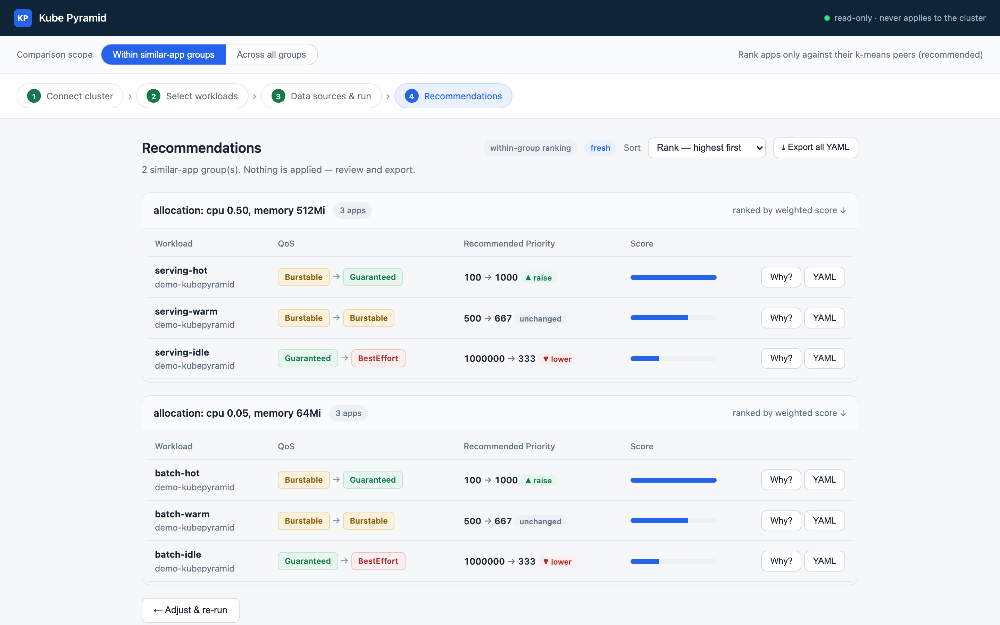
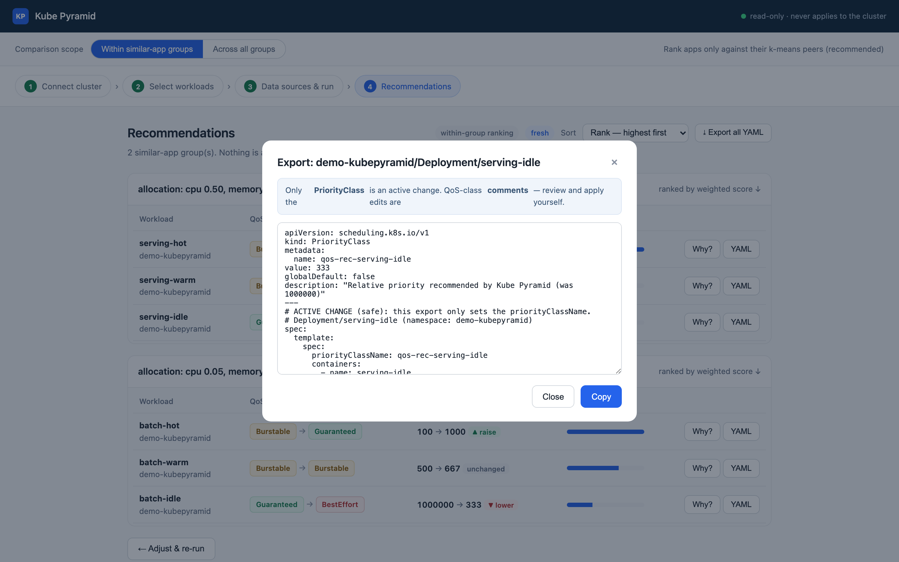

# Kube Pyramid

**Identify the real priority of your k8s applications - with data**

Kubernetes gives you two static, absolute knobs for saying *"this workload
is important"* — the pod's QoS class, and its PriorityClass integer. Both
are set at deploy time and independently across applications. This means 
its possible all end up at the top of the pyramid, i.e "please
don't evict me", meaning your cluster needs more resources and hence costs.

Kube Pyramid *looks* at your cluster and *tells* you
which workloads have been quietly hoarding priority they don't need — and
which under-appreciated workloads deserve a promotion. Named after pyramid,
representing application importance: Guaranteed at the top, then Burstable,
then Best-Effort.

Kube Pyramid reads your existing data (Prometheus, kube-state-metrics,
optionally Cilium/Hubble or Istio) and gives you two kinds of advice per
workload:

1. **QoS class** — _"Your `payments-idle` deployment is Guaranteed with a
   priority of 1,000,000, but its median CPU is 0.3% of what you asked for
   and it never spikes. Recommend BestEffort at priority 333."_
2. **PriorityClass integer** — _"Compared to its peers in the same allocation
   cluster, `payments-hot` is under-prioritized (Burstable, priority 100).
   It's the top-percentile CPU and memory consumer of the group. Recommend
   Guaranteed at priority 1000."_

**It never touches your cluster.** Read-only credentials, no mutating
admission webhooks, no operator. And when you export the recommendations
to YAML, only the safe knob (`priorityClassName`) is an active edit — the
QoS-class change is rendered as *commented* guidance, because changing QoS
means rewriting `requests`/`limits` and that can OOM-kill your app.

<p align="center">
  
</p>

## Two recommendations, one pipeline

Kube Pyramid runs a single algorithm that groups peers by allocation, ranks
within each peer group by utilization + interactions, and then reads out
the same rank order two ways: as a QoS class and as a PriorityClass integer.
Both are the same score-proportional value; they just materialize in
different corners of Kubernetes (kubelet vs scheduler).

The pipeline is deliberately small — a Phase A that clusters on the
N-dimensional allocation vector (with the log-then-standardize scaling and
a silhouette k-selection), and a Phase B that scores per-workload
percentile-rank across cpu, memory, and interactions, weighted per resource.
No LLM, no black boxes, every threshold config-driven.

### QoS class

For each workload, given its rank position within its allocation cluster:

- Top third of the group → **Guaranteed** (this app should be the last to be
  killed under node pressure).
- Middle third → **Burstable** (has a floor, can grow to a ceiling).
- Bottom third → **BestEffort** (first to be evicted; keeps the pyramid
  standing).

The split percentages are configurable, but equal thirds is the honest
default — it turns "everyone is Guaranteed" into a distribution that
reflects reality.

**Example output:**

```
serving-idle   Guaranteed(1000000)  →  BestEffort           lower ▼
   "Ranked #6 of 6 vs its allocation cluster (score 0.33); over-provisioned."
serving-hot    Burstable(100)       →  Guaranteed           raise ▲
   "Ranked #1 of 6 vs its allocation cluster (score 1.00); top-percentile CPU + memory."
```

### PriorityClass integer

From the same score: `priority = base + step × weighted_score`, clamped
below k8s's reserved system band. Defaults `base=0, step=1000`, so a score
of 1.0 → 1000 and 0.33 → 333. The relative delta is preserved: an app
scoring twice another gets exactly twice the priority integer.

**Example output:**

```
serving-hot     100  →  1000    ▲ raise      (Burstable → Guaranteed)
serving-warm    500  →   667    unchanged    (still Burstable)
serving-idle 1000000 →   333    ▼ lower      (Guaranteed → BestEffort)
```

Applied actively in the YAML export (see [safe-YAML export](docs/priority-ranking.md#safe-yaml-export)) —
this is the only knob Kube Pyramid actually edits on `kubectl apply`.

<p align="center">
  
</p>

## Try it in 5 minutes (no cluster needed)

The engine ships a synthetic-cluster generator, so you can go from zero to
recommendations without a Kubernetes cluster or a Prometheus:

```bash
# Engine — install
cd engine
python3 -m venv .venv && ./.venv/bin/pip install -e ".[dev]"

# 1) generate a synthetic cluster and rank against it (12 workloads, 2 groups)
./.venv/bin/kubepyramid-engine run --synthetic --k 2 --db-dsn ./demo.db

# 2) same data, but rank cross-group on util/allocation fraction
./.venv/bin/kubepyramid-engine run --synthetic --scope cross_group --db-dsn ./demo.db

# 3) serve the API + UI, then walk the wizard at http://localhost:8000/
KUBEPYRAMID_UI_DIR=../ui ./.venv/bin/kubepyramid-engine serve \
    --db-dsn ./demo.db --port 8000
```

Detailed walkthrough: [**docs/quickstart.md**](docs/quickstart.md).

## Deploy to Kubernetes

Per-module images and a Helm chart that runs the collector CronJob, engine
+ API, UI, and an optional bundled Postgres:

```bash
docker build -t kubepyramid/collector:0.1.0 collector/
docker build -t kubepyramid/engine:0.1.0    engine/
docker build -t kubepyramid/ui:0.1.0        ui/
helm install kp deploy/helm/kubepyramid -n kubepyramid --create-namespace \
  --set collector.promUrl=http://prometheus.monitoring:9090
kubectl -n kubepyramid port-forward svc/kp-kubepyramid-ui 8080:80
# open http://localhost:8080/
```

Full guide (external DB, ingress, kind/minikube demo, RBAC): [**docs/deployment.md**](docs/deployment.md).

## Prerequisites

- **Go ≥ 1.23** (to build the collector) and **Python ≥ 3.9** (to run the engine).
- No Kubernetes cluster is needed to try it — the engine ships a synthetic
  generator and uses SQLite by default. Postgres is supported for production.

## Deeper reading

- [**Quickstart**](docs/quickstart.md) — the 5-minute walk-through, with the
  synthetic → analyze → serve → API loop.
- [**Deployment guide**](docs/deployment.md) — Helm chart, kind/minikube demo,
  ingress, external Postgres, RBAC.
- [**Architecture**](docs/architecture.md) — the three modules, the shared
  analysis core, the state-DB contract, and how the collector fits in.
- [**Priority ranking deep dive**](docs/priority-ranking.md) — Phase A / Phase
  B, cross-group mode, confidence scoring, and the safe-YAML export model.
- [**REST API reference**](docs/api.md) — full `/api/v1` surface with DTOs.
- [**Contributing**](docs/contributing.md) — how to run tests, layout a
  change, and the contracts you must not break.

<details>
<summary><b>REST API — quick reference</b></summary>

Base path `/api/v1` (served by `kubepyramid-engine serve`):

| Method | Path | What it does |
|---|---|---|
| `POST` | `/runs` | Start a run: `{cluster, scope, config?, k?, ttl?}` → `{run_id, name, status}` |
| `GET`  | `/runs` | Run history (each entry surfaces `run_type`) |
| `GET`  | `/runs/{id}` | Run status + freshness (`data_as_of`, `stale`) |
| `GET`  | `/runs/{id}/groups` | Allocation groups + nested recommendations |
| `GET`  | `/runs/{id}/recommendations` | Flat recommendation cards |
| `GET`  | `/runs/{id}/recommendations/{recId}/evidence` | The "why": per-resource percentiles + peers. `?series=false` for text only |
| `GET`  | `/runs/{id}/export` | YAML export: `scope=all` or `scope=workload&uid=<uid>` |
| `GET/POST/DELETE` | `/clusters`, `/clusters/{id}` | Manage connected clusters |
| `POST` | `/clusters:test`, `/clusters/{id}:test` | Live cluster connectivity probe (kubeconfig / SA token / client cert / basic auth) |
| `GET`  | `/clusters/{id}/namespaces`, `.../workloads` | Browse discovered workloads |
| `GET/POST/PUT/DELETE` | `/clusters/{id}/data_sources`, `/data_sources/{id}` | Manage metric sources |
| `GET/PUT` | `/settings` | Default thresholds and data-retention windows |
| `POST/GET` | `/collections`, `/collections/{id}` | Trigger + poll on-demand collection |

Full reference with DTOs, request bodies, and error shapes: [**docs/api.md**](docs/api.md).

</details>

## Status

**Working today** (verified end-to-end on a local 3-node Docker Desktop cluster):

- Collector's Prometheus path — `allocations` (KSM incl. extended/custom
  resources like `nvidia.com/gpu`), arbitrary-resource utilization, and
  interactions from a **swappable source** (Hubble / Istio / OTel behind
  the same registry).
- The full ranking pipeline: log-then-standardize scaling, silhouette
  k-selection with a fixed-k fallback, k-means clustering, median +
  interaction-sum representative, percentile rank, weighted aggregate,
  QoS-third assignment, score-proportional priority integer.
- Cross-group utilization/allocation-fraction mode.
- Confidence scoring (coverage + boundary + allocation-realness).
- Optional cost estimate (per-workload monthly $, plus null when disabled).
- Deterministic per-recommendation "why" + downsampled per-resource
  utilization series.
- Docs/08 safe YAML export: active PriorityClass + commented QoS guidance
  sized from observed P50/P95, memory-peak floored.
- Full `/api/v1` REST surface + FastAPI-generated OpenAPI docs.
- A static UI wizard with per-workload checkboxes, weight sliders, live
  connectivity probe on the Add-cluster modal, "Why?" evidence + peer
  panels, and single-workload or bulk YAML export.
- Container images + a Helm chart for Kubernetes (bundled demo Postgres or
  external DB, RBAC, optional Ingress).

**Not built yet:**

- Live discovery refresh — querying a connected cluster's Kubernetes API to
  list namespaces/workloads on demand (the stubbed `?refresh=true` path).
  Discovery through the collector's cache works today.
- Native Hubble-Relay gRPC interaction source. Hubble metrics scraped via
  Prometheus work today; a direct gRPC path is on the roadmap.
- Direct k8s-API allocations for resources KSM doesn't surface. KSM covers
  standard + extended resources today; a fallback path for exotic vendor
  resources is on the roadmap.
- Weighted-QoS split calibration by cluster / team / cost budget. Equal
  thirds is the default; smarter splits are on the roadmap.

## Contributing

Bug reports and PRs welcome — see [**docs/contributing.md**](docs/contributing.md)
for the mechanics. Two things to keep an eye on:

- **Tests stay green.** Engine: `cd engine && ./.venv/bin/pytest`. Collector:
  `cd collector && go test ./...`.
- **Contracts.** The database schema is the only cross-module contract — see
  `collector/internal/store/migrations/`. `/api/v1` DTOs are the other
  contract; keep them stable.

## License

MIT — see [`LICENSE`](LICENSE). Permissive: commercial use, private forks,
SaaS hosting, and academic/research use are all allowed. Downstream users
must keep the copyright notice and the license text.
